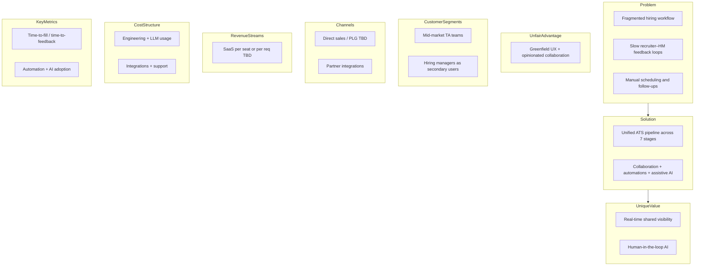
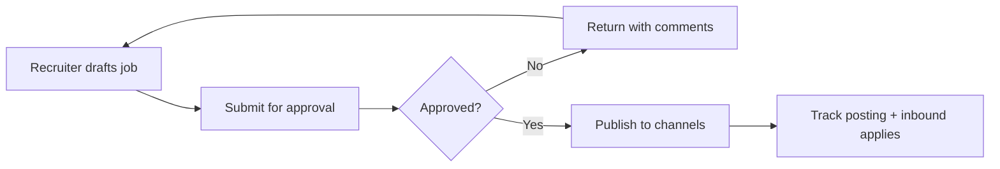
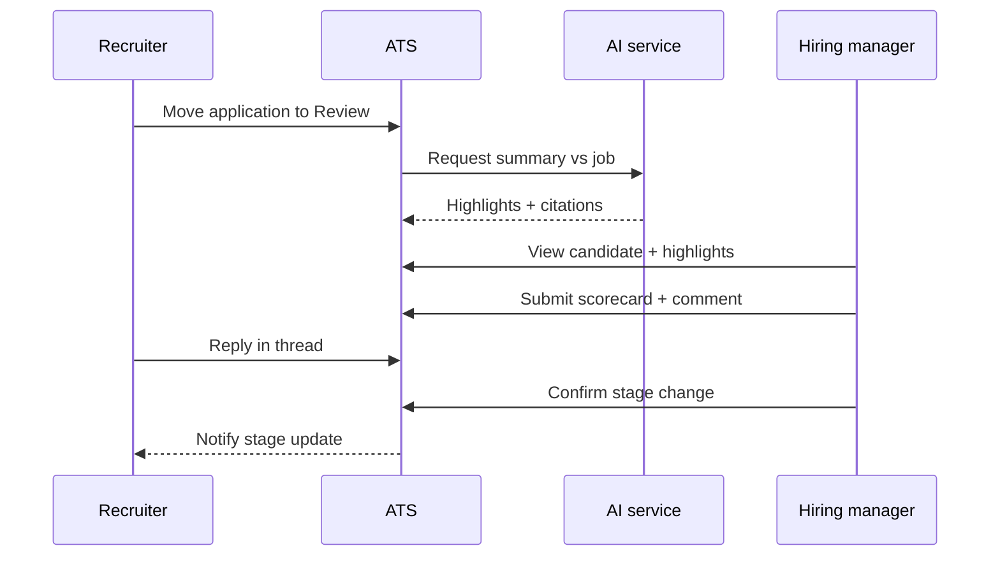
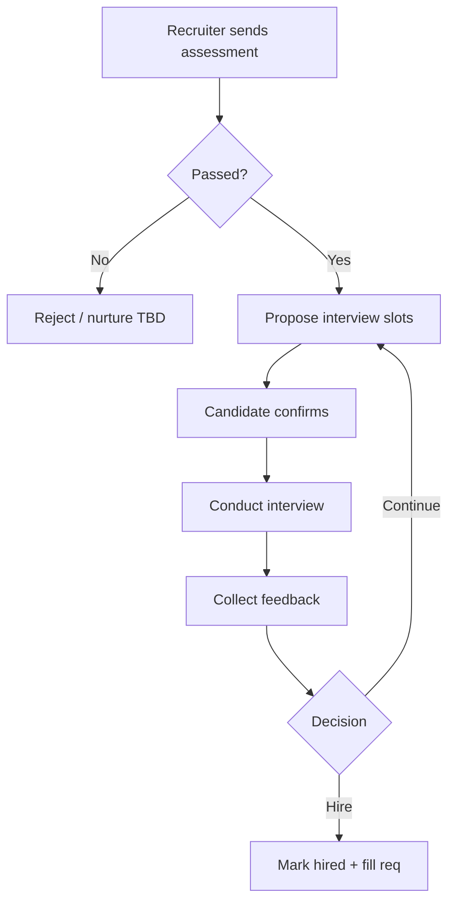
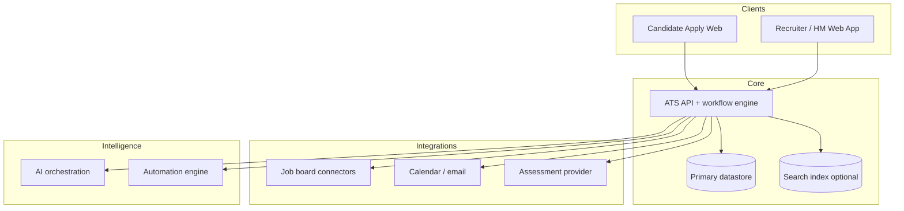
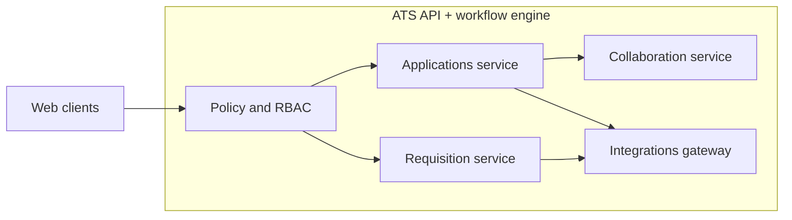

# LTI ATS — Product Requirements Document

## Document control

- **Version:** 0.5
- **Last updated:** 2026-03-22
- **Author / source:** Course brief (ReadMe.md) + seven-stage ATS lifecycle framing; PRD shaped per generate-prd skill.

## Executive summary

LTI is building a next-generation **Applicant Tracking System (ATS)** from a greenfield position. Recruiting teams still lose time to fragmented tools, slow feedback loops between recruiters and hiring managers, and manual steps across posting, screening, scheduling, and close. This PRD defines an MVP that covers the **end-to-end hiring funnel**—from **job creation** through **hire**—while baking in LTI’s intended differentiators: **HR efficiency**, **real-time recruiter–hiring manager collaboration**, **workflow automations**, and **human-in-the-loop AI assistance** (drafting, ranking support, scheduling nudges—not autonomous hiring decisions).

The recommended direction is a **single coherent ATS workspace** with shared pipeline visibility, configurable stages aligned to the seven lifecycle areas, integrations to common **job boards**, **calendars**, and **assessment providers**, and an **audit-friendly** activity history for screening and decisions. MVP should prove collaboration + automation value on one primary persona pair (recruiter + hiring manager) before expanding depth in compliance, global payroll, or niche HRIS variants.

## Goals and non-goals

### Goals

- Support the **seven ATS stages** as first-class capabilities: job creation, job posting, application intake, application review, online assessments, interview scheduling, and hiring selected candidates.
- Reduce time-to-feedback and rework via **shared requisition and candidate views**, comments, @mentions, and **live or near-real-time** updates where feasible.
- Offer **rules-based automations** (e.g., stage transitions, notifications, task creation) with clear ownership and safeguards.
- Embed **AI assistance** for summarization, draft communications, and **assistive** ranking/screening with transparency, overrides, and logging.
- Ship **testable** functional and non-functional requirements suitable for design phases (use cases, data model, high-level architecture).

### Non-goals

- **Final legal interpretation** of employment law, pay equity regulations, or jurisdiction-specific hiring rules (treat as assumptions / open questions).
- **Full HRIS / payroll** implementation as part of MVP (integration hooks may exist; depth is phased).
- **Autonomous** hiring decisions or unsupervised rejection of candidates without human action.
- **Authoritative** typed ERD, deployment topology, or deep C4 as product truth—those belong in architecture deliverables with **develop-architect**.

## Target users and personas

| Persona | Goals | Pains (hypothesis) |
|--------|--------|---------------------|
| **Recruiter / TA** | Fill reqs quickly with quality; keep candidates warm; compliance hygiene | Context switching across email, spreadsheets, boards; chasing HM feedback |
| **Hiring manager** | Fast clarity on fit; minimal admin; confident decisions | Opaque pipeline; slow scheduling; inconsistent scorecards |
| **TA / system admin** | Templates, access control, integrations, reporting | Fragile configs; integration maintenance |
| **Candidate** (in-scope for MVP flows) | Clear application status; fair process; accessible UX | Black holes; repetitive data entry *(assumption: degree of candidate portal scope in MVP—see Open questions)* |

## Problem statement

Hiring is a **multi-stage workflow** spanning many tools and handoffs. When job creation, posting, intake, review, assessments, interviews, and hire steps are weakly connected, teams duplicate work, lose auditability, and delay decisions. Incumbent ATS products often optimize for checklists rather than **tight collaboration** and **intelligent assistance**, leaving room for LTI to differentiate if execution stays focused.

## Proposed solution (high level)

A unified ATS that models each requisition and application through **configurable pipeline stages** mapped to the seven lifecycle areas, with:

- **Collaboration surfaces** on jobs and candidates (threads, shared scorecards, presence/updates).
- **Automation engine** (rules + triggers) for notifications, tasks, and stage changes within policy.
- **AI layer** for drafts and summaries, plus **assisted** screening with explicit human approval.
- **Integration adapters** for postings, calendar, email, and assessment vendors at MVP breadth.

## User journeys (summary)

- **Recruiter: req → post → inbound** — Create approved requisition, publish to selected channels, monitor applicant volume and source effectiveness.
- **Recruiter + hiring manager: triage → assess → decide** — Shared review of applications, structured feedback, trigger assessments, compare notes before advancing or rejecting.
- **Coordinator: schedule → offer → hire** — Propose interview slots with calendar awareness, collect feedback, move to offer/hired with audit trail.

## Functional requirements

Requirements are grouped by the seven ATS stages; cross-cutting **collaboration**, **automation**, and **AI** are called out explicitly.

### Job creation

- **FR-001** The system shall allow authorized users to **create and edit job requisitions** with core fields (title, department, location model, employment type, description, compensation band *optional*, headcount, hiring team).
- **FR-002** The system shall support **approval states** for requisitions (e.g., draft → pending approval → approved) *exact policy is configurable assumption*.
- **FR-003** The system shall allow **job templates** and duplication from prior requisitions to reduce setup time.

### Job posting

- **FR-004** The system shall publish approved jobs to at least one **external channel** (e.g., job board feed or embed) and the **company careers page** *specific vendors TBD*.
- **FR-005** The system shall track **posting status** and basic **source attribution** for applicants where technically available.
- **FR-006** The system shall allow **scheduling or expiring** postings aligned to requisition status.

### Application intake

- **FR-007** The system shall **collect applications** via an apply flow (upload resume/CV, profile fields, consent checkboxes as required).
- **FR-008** The system shall **parse and store** application materials and maintain a **single candidate profile** with multiple applications *dedupe rules in Open questions*.
- **FR-009** The system shall support **knockout / minimum qualification** questions configurable per job *human review of edge cases*.

### Application review

- **FR-010** The system shall present applications in a **pipeline view** with stage, owner, and timestamps.
- **FR-011** The system shall support **structured feedback** (scorecards, ratings, free text) from recruiters and hiring managers.
- **FR-012** The system shall provide **AI-assisted summaries or highlights** of resumes against job requirements with **visible rationale snippets** and **mandatory human confirmation** before any negative action *assumption on MVP depth*.
- **FR-013** The system shall log **who changed stage** and when for auditability.

### Online assessments

- **FR-014** The system shall allow **launching an assessment** for a candidate from a pipeline stage and recording **pass/fail/pending** outcome.
- **FR-015** The system shall integrate with at least one **assessment provider** via link-out or API *provider TBD*.
- **FR-016** The system shall restrict visibility of assessment results to **role-appropriate** users.

### Interview scheduling

- **FR-017** The system shall support **proposed interview slots**, participant roles, and **calendar availability** integration *calendar vendor TBD*.
- **FR-018** The system shall send **notifications** (email and/or in-app) for invites, changes, and reminders.
- **FR-019** The system shall associate **interview feedback** with the application record.

### Hiring selected candidates

- **FR-020** The system shall support marking a candidate as **hired** and capturing **start date** and **requisition fill** status.
- **FR-021** The system shall support **rejection** with templated messaging and **opt-out / consent** respect where applicable *wording subject to legal review*.
- **FR-022** The system shall generate **basic hiring funnel metrics** per requisition (time-in-stage, conversion rates).

### Collaboration (cross-cutting)

- **FR-023** The system shall provide **shared visibility** of the same candidate record to recruiter and hiring manager roles with **permission boundaries**.
- **FR-024** The system shall support **real-time or near-real-time** updates (e.g., comments, stage changes) so collaborators see changes without manual refresh *implementation depth is architecture-owned*.

### Automations (cross-cutting)

- **FR-025** The system shall allow **rule definitions** (trigger → actions) such as “application submitted → notify hiring team” or “stale stage N days → task.”
- **FR-026** The system shall provide an **automation audit log** (rule id, actor/system, timestamp).

### AI assistance (cross-cutting)

- **FR-027** The system shall expose AI features only with **tenant-configurable** enablement and **role-based** access.
- **FR-028** The system shall record **AI-generated outputs** linked to the target record for traceability *retention policy TBD*.

## Non-functional requirements

**Numbering:** NFR identifiers **NFR-001**–**NFR-011** follow **top-to-bottom order** in this section (not insertion history).

### Security and privacy

- **NFR-001** Role-based access control (RBAC) shall enforce least privilege on candidate PII and assessment results.
- **NFR-002** The system shall support **audit trails** for critical actions (stage changes, offers, rejections, AI-assisted recommendations).

### Candidate PII privacy lifecycle

- **NFR-003** The system shall enforce **configurable retention windows** for candidate and applicant PII by category (e.g., active pipeline, rejected, hired, withdrawn), including **system-enforced** limits on continued processing and routine access after a retention period expires *specific durations and legal bases are assumptions pending counsel*. Only **authorized roles** (per **NFR-001**) shall configure retention policies or approved exceptions; **changes to retention policy** and **scheduled enforcement events** SHALL be **recorded in audit trails** per **NFR-002**.

- **NFR-004** The system shall support **automated** lifecycle actions (e.g., scheduled archival, queued deletion, **secure purge** of application data from primary stores and search/index replicas when due) and **manual** deletion or erasure workflows initiated by **privacy/admin** roles (per **NFR-001**). Each **deletion, anonymization, redaction, or purge** (automated or manual) SHALL emit **audit events** per **NFR-002** including actor (user or system job), target scope, action type, timestamp, and outcome, so retention and erasure are **demonstrable**.

- **NFR-005** The system shall process **consent withdrawal** and similar objections by updating processing flags, stopping consent-dependent processing, and **triggering** applicable retention or erasure flows. It SHALL apply **data minimization** for candidate PII—collect and retain only fields necessary for declared purposes and restrict secondary use without appropriate basis. Withdrawal and minimization-related actions SHALL be **permissioned** per **NFR-001** and **auditable** per **NFR-002**.

- **NFR-006** The system shall provide **export / portability** of applicant and candidate data pertinent to a verified **subject or regulatory request** in a **structured, portable** form where feasible. Fulfillment SHALL be **RBAC-gated** per **NFR-001**, and each export, download, or disclosure package generation SHALL be **logged** per **NFR-002** (who, what scope, when). **Secure purge** of backups and long-term copies SHALL follow agreed operational windows aligned with **NFR-008** (RPO/RTO) and contractual erasure commitments *implementation detail with architect*.

### Performance and reliability

- **NFR-007** Core list views (applications per job) shall remain usable under **expected concurrent recruiter load** *numeric SLO TBD with architect*.
- **NFR-008** The platform shall define **RTO/RPO** targets for MVP *Open question*.

### Accessibility and inclusion

- **NFR-009** Candidate-facing apply flows shall target **WCAG 2.1 AA** *validation approach TBD*.

### Observability

- **NFR-010** The system shall emit **structured logs/metrics** for integration failures (posting, calendar, assessments) for operations.

### Fairness (AI)

- **NFR-011** AI-assisted screening shall support **disclosure** to internal users that output is probabilistic; shall not be sole criterion for auto-reject without human action in MVP.

## Success metrics

- **Time to first hiring manager feedback** on new applications (median hours).
- **Recruiter active time** per hire on scheduling and follow-ups *(leading indicator)*.
- **Interview schedule lead time** (invite sent → confirmed).
- **Offer acceptance rate** and **time-to-fill** per requisition *(lagging)*.
- **Automation adoption**: % of reqs with at least one active rule; **override rate** on AI suggestions *(quality guardrail)*.

## Milestones / phasing

| Phase | Scope |
|-------|--------|
| **MVP** | Requisitions, posting to limited channels, apply + pipeline, basic review/scorecards, one assessment integration path, scheduling with email notifications, hire/reject, RBAC, audit on stage changes, one collaboration feature (comments + notifications), **limited** automations and **assistive** AI (summaries). |
| **Next** | Deeper calendar sync, more board integrations, advanced dedupe, analytics workspace, expanded compliance tooling. |

## Risks, assumptions, dependencies

- **Risks:** Integration fragility with boards/calendars; AI perception risk if not transparent; scope creep in compliance.
- **Assumptions:** MVP targets one primary market segment; **multi-tenant MVP posture is decided:** shared schema with **row-level tenant scope** via **`organization_id`** on tenant data, enforced in the **application layer** for MVP (**ADR-002** in **`LTI-ICS/ADR.md`**); optional **PostgreSQL Row-Level Security (RLS)** remains a later hardening step if compliance drivers require it; assessment and job-board partners exist or link-out suffices early.
- **Dependencies:** Third-party APIs, email delivery, identity provider, legal templates for candidate communications.

## Open questions

- Which **job boards** and **assessment** vendors are in scope for MVP?
- Required **data residency** or **DPA** constraints for customer pilots?
- **Candidate portal** depth: guest apply only vs. authenticated candidate accounts?
- **Dedupe** strategy across email, phone, and resume hash—business rules?
- **Offer management** (e-sign, compensation approval) in or out of MVP?

## Lean Canvas

## Use cases

### UC-1 — Create, approve, and post a job

**Actors:** Recruiter, Hiring manager (approver), System admin (optional).  
**Goal:** Publish an approved opening to the careers site and at least one external channel.  
**Success:** Job is visible to candidates; sourcing parameters captured; hiring team notified.

A recruiter drafts a requisition from a template, routes it for approval, and upon approval publishes to configured channels. Posting status and application link are visible on the requisition.

### UC-2 — Collaborative application review with assistive AI

**Actors:** Recruiter, Hiring manager, AI assistant (system).  
**Goal:** Triage and evaluate applicants with shared feedback and optional AI highlights.  
**Success:** Stage changes are justified, logged, and visible to both roles; no auto-reject without human action.

The hiring manager sees new applications in a shared pipeline view, reads AI-generated highlights (clearly labeled), adds a scorecard, and discusses in-thread with the recruiter. They advance or reject with audit trail.

### UC-3 — Assessment, interview, and hire

**Actors:** Recruiter, Hiring manager, Candidate, Assessment provider (external).  
**Goal:** Move finalist through assessment and interviews to hired.  
**Success:** Scheduled interviews, captured feedback, clear hired outcome on requisition.

Recruiter triggers an assessment; on pass, proposes interview slots; candidate confirms; interviewers submit feedback; hiring team marks hire and closes the req.

## Data model (conceptual)

*Conceptual only—finalize cardinalities and engineering types with **develop-architect** / typed ERD.*

| Entity | Purpose | Key attributes (conceptual) | Relationships |
|--------|---------|----------------------------|---------------|
| **Organization** | Tenant boundary | `id`, `name` | 1..* **User**; aggregates tenant-owned entities below |
| **User** | Login identity | `id`, `organization_id`, `email`, `role` | belongs to **Organization** |
| **JobRequisition** | Hiring need | `id`, `organization_id`, `title`, `status`, `headcount` | belongs to **Organization**; *posts* **JobPosting**; *has* **Application** |
| **JobPosting** | Channel-specific publication | `id`, `organization_id`, `channel`, `status`, `url` | belongs to **Organization**; belongs to **JobRequisition** |
| **Candidate** | Person *(tenant view)* | `id`, `organization_id`, `name`, `contact` | belongs to **Organization**; *submits* **Application** *assumption (MVP): candidate profile is **organization-scoped**; cross-org dedupe/global identity is out of scope unless raised in Open questions* |
| **Application** | Candidate + job instance | `id`, `organization_id`, `stage`, `submitted_at` | belongs to **Organization**; links **Candidate** ↔ **JobRequisition** |
| **AssessmentAttempt** | Test run | `id`, `organization_id`, `status`, `score_summary` | belongs to **Organization**; belongs to **Application** |
| **Interview** | Scheduled event | `id`, `organization_id`, `start_time`, `format` | belongs to **Organization**; belongs to **Application** |
| **Feedback** | Review notes/scorecard | `id`, `organization_id`, `author`, `payload` | belongs to **Organization**; targets **Application** |
| **AutomationRule** | Trigger/action | `id`, `organization_id`, `definition`, `enabled` | belongs to **Organization** |
| **AuditEvent** | Traceability | `id`, `organization_id`, `action`, `actor`, `timestamp` | belongs to **Organization**; references domain records *(same `organization_id` as the record being audited, for tenant-isolated audit queries)* |

## High-level system design

At product depth, LTI ATS is a **web application** backed by a **core API** enforcing RBAC and workflow rules. **Integration services** connect to job boards, email, calendar, and assessments. An **AI orchestration** component calls model APIs with retrieved job/application context, stores outputs for audit, and never bypasses authorization.

## C4 component focus (draft)

*Draft for course alignment—**develop-architect** should refine boundaries, protocols, and trust zones.*

**Container in focus:** `ATS API + workflow engine`  
**Components (illustrative):**

- **Requisition service** — approvals, templates, job metadata.
- **Applications service** — intake, pipeline stages, dedupe hooks.
- **Collaboration service** — comments, notifications, real-time fan-out *technology TBD*.
- **Integrations gateway** — normalizes external provider calls; retries and dead-letter handling.
- **Policy & RBAC** — authorization decisions shared across services.

## Appendix

### Glossary

- **ATS:** Applicant Tracking System.  
- **Requisition / req:** Internal hiring record for a role.  
- **Application:** A candidate’s submission against a specific requisition.  
- **Pipeline stage:** A step in the hiring funnel (maps to one or more of the seven lifecycle areas).

### References

- Repository **`ReadMe.md`** — LTI exercise context and deliverable checklist.  
- **`.cursor/rules/10-project-overview.mdc`** — product differentiators and design phases.
